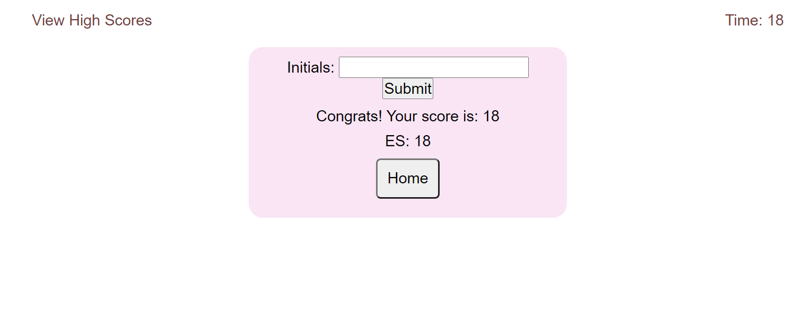

# Code Quiz

The purpose of this application is to create an interactive code quiz!
As the user navigates through the questions, the intended results of presenting the next question when answered correctly, subtracting time when answered incorrectly, and ability to save their score are intuitive and functional. 

A key feature in this application is the validating of the user's answer. Though the intended result of having the high scores display in order based on score and not based on subsequent submissions was not achieved, this was a very good and challenging exercise in storing and retrieving data in local storage. 

This application can be accessed via the following link: [https://ericaleesnyder.github.io/code-quiz/]

### Usage
Upon loading the page, the user has two choices - to start the game or to view high scores. When the start button is clicked, the user will have the opportunity to cycle through questions. If answered correctly, the user can move on. If answered incorrectly, 10 seconds is subtracted from the time and they must choose again. 

The quiz ends either when the user has correctly answered all of the questions, or when time runs out as a result of incorrect selections or the timer simply reaching 0. 

The score the user receives is equivalent to the time remaining on the count down. 

### Images

### Challenges
This application was very difficult for me to develop. There were portions that I understood and was able to implement in an organized manner, and there were portions that required so much troubleshooting that my code is not as clean as it could (or should) be. 